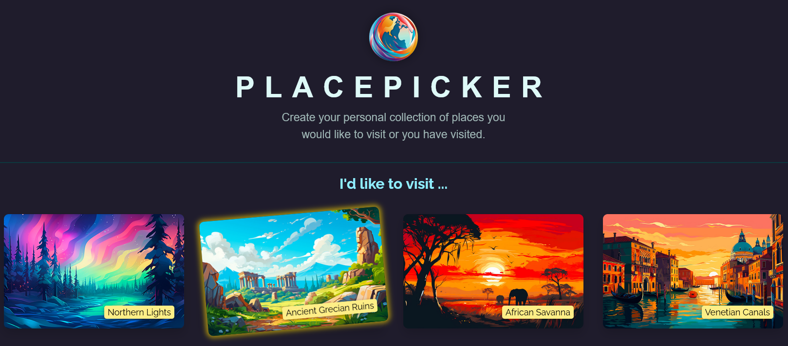
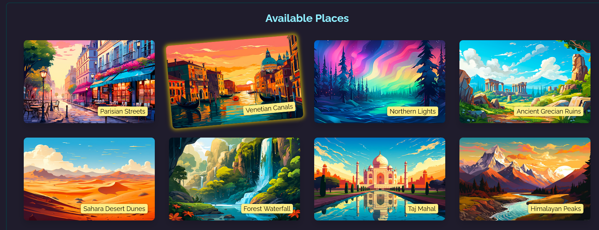
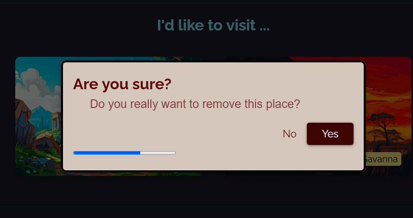
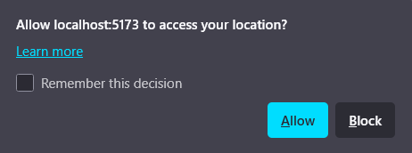

# 📍 PlacePicker - React + Geolocation App

## 📚 Overview

**PlacePicker** is a React application that allows users to build a personalized list of places they want to visit. By leveraging the **Geolocation API**, it sorts locations by distance from the user, provides an interactive modal for confirmation, and uses `localStorage` to persist selections. Built using **Vite** for rapid development and performance.

---

## 🚀 Features

- **Geolocation-Based Sorting** – Places are ordered based on your current location.
- **Persistent Place Selection** – Saves selected places locally between sessions.
- **Interactive Modal Confirmation** – Prevents accidental deletions with a timer-based dialog.
- **Progress Bar Component** – Visual feedback during delete confirmation.
- **Component-Based Architecture** – Clean and modular UI.
- **Built with Vite** – Fast dev experience and optimized build.

---

## 💻 Technologies Used

- **React** – Component-based frontend framework.
- **JavaScript (ES6+)** – Modern syntax and logic.
- **Vite** – Fast build tool and dev server.
- **CSS** – Basic styling and layout.
- **HTML5 Dialog Element** – Native modal support.
- **Geolocation API** – Browser-based location access.

---

## 📸 Project Preview






---

## 📂 Project Structure

```
place-picker/
├── public/                     # Static files
├── src/
│   ├── assets/                 # Logo and other static media
│   ├── components/             # Reusable React components
│   │   ├── DeleteConfirmation.jsx
│   │   ├── Modal.jsx
│   │   ├── Places.jsx
│   │   └── ProgressBar.jsx
│   ├── data.js                 # Static place data
│   ├── loc.js                  # Geolocation helper functions
│   ├── App.jsx                 # Root component
│   ├── index.css               # Global styles
│   └── main.jsx                # Entry point
├── index.html
├── package.json
├── vite.config.js
└── README.md
```

---

## 💾 Installation & Setup

### 1️⃣ Clone the Repository

```bash
git clone https://github.com/Caiko/holiday-placepicker.git
cd place-picker
```

### 2️⃣ Install Dependencies

```bash
npm install
```

### 3️⃣ Start the Development Server

```bash
npm run dev
```

Then visit [http://localhost:5173](http://localhost:5173) in your browser.

---

## ⚙️ Usage

### ✅ Select a Place

- Choose a place from the **Available Places** list.
- It gets added to your **I'd like to visit...** list and saved in `localStorage`.

### ❌ Remove a Place

- Click on a selected place.
- A modal opens asking for confirmation.
- If no response in 3 seconds, the place is automatically removed.

---

### 📦 Local Storage Handling

```js
localStorage.setItem("selectedPlaces", JSON.stringify([...ids]));
const storedIds = JSON.parse(localStorage.getItem("selectedPlaces")) || [];
```

### 📍 Geolocation & Sorting

```js
navigator.geolocation.getCurrentPosition((position) => {
  const sorted = sortPlacesByDistance(
    AVAILABLE_PLACES,
    position.coords.latitude,
    position.coords.longitude
  );
  setAvailablePlaces(sorted);
});
```

### ⏱ Delete Timer & Progress Bar

```jsx
useEffect(() => {
  const timer = setTimeout(onConfirm, 3000);
  return () => clearTimeout(timer);
}, [onConfirm]);
```

---

## 🧠 Notes

This project focuses on practicing:

- Real-world usage of `useEffect`, `useRef`, `useCallback`
- Declarative modal control via the native `dialog` element
- Data persistence with `localStorage`
- Sorting data dynamically based on user's geolocation
